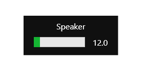
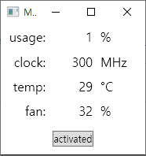

# 연락처
- Email: augtitan@gmail.com

 

# 기술 스택
- ## 프로그래밍 언어
  - Javascript, C#, Python, Java, SQL
- ## 프레임워크 & 라이브러리
  - WPF, Flask, Spring
- ## 도구 & 기술
  - Docker

 

# 개인 프로젝트
- ## 익명 게시판
  - ### 설명
    - Spring 프레임워크와 오라클 데이터베이스를 활용한 MVC 패턴의 게시판, 게시글 검색, rest api 계층형 댓글, lusy xss filter를 적용
  - ### 데모
    - http://141.147.182.120:55000/spring-mvc/bbs

 

# 경험
- JavaScript
  - 웹 브라우저의 페이지 내에서 선택된 텍스트를 번역한 내용을 작은 모달을 생성하여 보여주는 확장 프로그램을 만들었습니다.
  - 유저스크립트 확장 프로그램을 활용하여 동영상의 오버레이와 단축키 기능과 유튜브 플레이어의 기본 기능에 더해 배속 재생, 화질 변경에 단축키를 추가하는 등의 편의성을 추가했습니다.

- C#
  - 윈도우의 볼륨 조절 단위를 데시벨 단위로 바꾸기 위해 데시벨인 로그함수의 역함수인 지수함수를 적용한 볼륨 조절 프로그램으로, 기존의 팝업시간이 길어 불편한 윈도우 볼륨 오버레이를 대체한 오버레이를 만들었습니다.
     
  - 윈도우에서 파일들을 보기 쉽도록 하기위해 트리뷰 파일 탐색기를 만들었습니다. 메모리를 절약하기 위해 중복되는 파일 아이콘을 아이콘 --> 비트맵 --> 바이트 배열 --> SHA1 해쉬(바이트 배열) --> 헥스 문자열 순으로 변환 하여서 키벨류 콜렉션에 문자열과 소스로 저장했습니다.
  - WPF MVVM 패턴으로 NVAPI 래퍼 라이브러리를 활용한 그래픽카드 상태 확인 및 쿨러 팬 속도 제어 프로그램을 만들었습니다.
     

- Python
  - 웹브라우저의 번역 확장 프로그램을 위한 구글 번역 페이지 크롤링 서버를 만들었습니다.

- Java
  - MVC 패턴의 게시판을 만들었고 게시글 검색, rest api 계층형 댓글, lusy xss filter를 추가 했습니다.

 

# 자격증
- 정보처리기사
